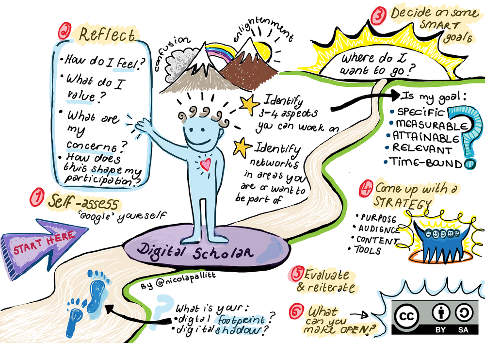

## Improving Your Digital Literacy: Becoming a Digital Citizen

This paper is aimed at helping you develop your digital literacy in a range of areas in order to become a digital citizen.

* * *

### Activity #4
#### How digitally literate are you?

> Why not take stock of where you are right now. How digitally literate are you, and do you know what that means?
>
> Download this model of the [digital literacy development framework](https://waikatouniversitynz-my.sharepoint.com/:w:/g/personal/stephen_harlow_waikato_ac_nz/EVsMiNUkCmBLheD510cQZNsBN9i8zM14FLQJT5u1t-_GzQ?e=6B1lKb) and complete it while thinking about your access, skills, practices and identities. This will help you take stock of where you are now and help you focus on where you want to develop.

* * *

### Explore Your Digital Identity

Digital identity refers to your “online self,” the side of you that people see on the Internet. We all have different identities in different contexts and one of the things about being a digital citizen is the ability to control the representation of yourself in the online environment.

* * * 

### Activity #5
#### How do others see you online?

> Search for references to yourself on the Internet by looking up your name using your preferred search engine. What do you have to type in to find the “real you” and not either someone else with the same name or a one-dimensional representation of you? Is this an accurate representation of who you are, what your interests are, what you find interesting, and what you share with others online?
>
> Once you’ve reviewed your search results, have a look at this TedX talk “[What Do Your Digital Footprints Say About You?](https://www.youtube.com/watch?v=RVX8ZSAR4OY)” by digital education and social media expert Nicola Osbourne.

* * *

Were you happy with the results of the search in Activity #5? Is there something you would like to change? One of the problems with information online is that once it is there, it is often very difficult to delete. Being aware of what you share online is a very important digital skill.

Using the image below, reflect on your digital footprint. Decide on some SMART goals (specific, measurable, attainable, relevant, and time-bound), and identify how you want the virtual “you” to look to the various people who might see you online: friends, family (including your grandmother!), teachers and professors, coaches, neighbours, potential employers, potential dates, or complete strangers.

Reflecting on your digital identity

This paper is aimed at helping you develop your digital literacy in a range of areas in order to become a better digital citizen. By the end of this paper, you will be able to more effectively and responsibly:

- Engage in digital practices.
- Critically evaluate information, online interactions, and online tools.
- Manage and communicate information.
- Collaborate and share digital content.
