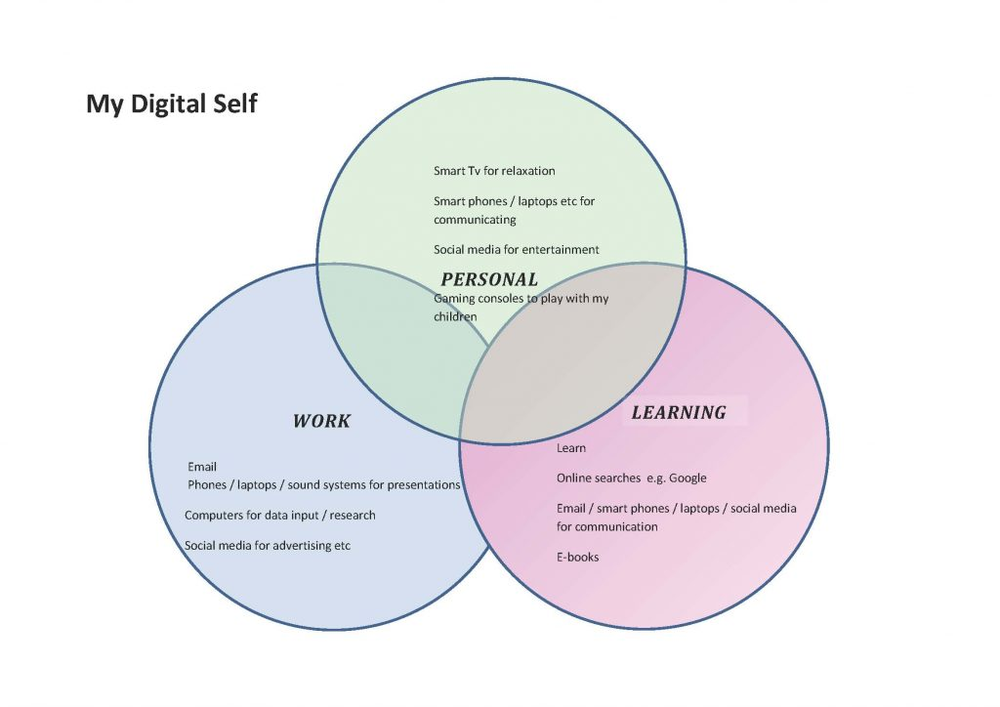

## Taking Stock of Your Digital Self

You probably already use a range of technologies and digital tools in different aspects of your life. You might use mobile technologies, like a phone or tablet, to download materials or information from the Internet, or you may use them to communicate with friends and family. You may use information and communication technologies (ICT) mainly for work or for learning, or you might use it primarily for entertainment. In reality, people often use different technologies and tools for a mixture of purposes.

* * *

### Activity #1
### Thinking About Your Digital Self

> Think about all the ways you use technology in your personal life (e.g. for entertainment, shopping, sharing photos, communicating with people, etc). Who do you interact with digitally, and how do you do this (i.e., what applications/websites do you use and for which purpose)? Now think about yourself as a student and the ways you use technology for learning?
>
> Make a list or draw a diagram of your activities, noting the groups or networks you interact with digitally and thinking about how you use digital technology in the various spheres of your life.
>
> You might like to try doing this digitally using this editable mind map about [digital footprints](https://creately.com/diagram/example/gu9tfwix2/digital-footprint) on [creatly.com](https://creately.com/) or by making a drawing of your digital self on paper.

