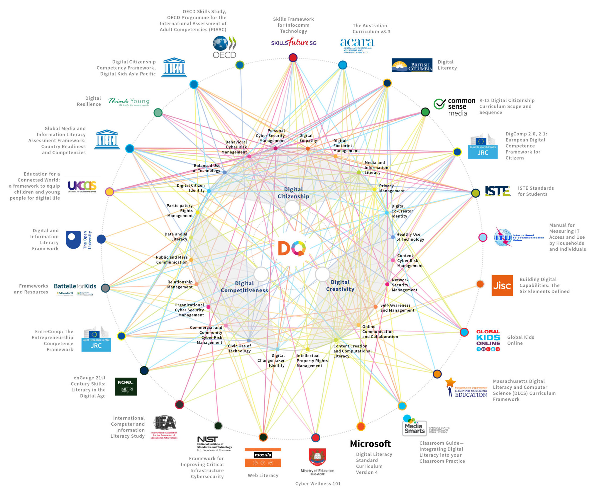
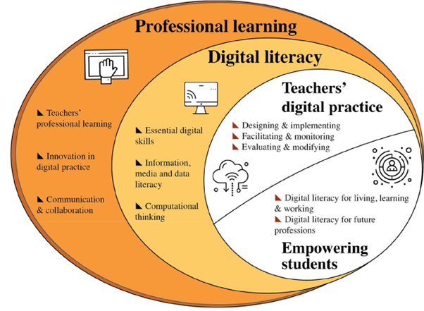

## Digital Literacy Frameworks

While a definition remains somewhat contested, our understanding of digital literacy as a concept has been closely associated with the development of supporting frameworks. In the last quarter of a century there has been a plethora of frameworks developed. Some of the better known frameworks are mapped below.

<!--  -->
<iframe src="https://elearn.waikato.ac.nz/h5p/embed.php?url=https%3A%2F%2Felearn.waikato.ac.nz%2Fpluginfile.php%2F3703520%2Fmod_h5pactivity%2Fpackage%2F0%2FDigital%2520Literacy%2520Map.h5p&amp;component=mod_h5pactivity" name="h5player" width="1522" height="1288"
   allowfullscreen="allowfullscreen" class="h5p-player w-100 border-0"
   style="height: 0px;" id="67aeae43a800467aeae43a80081-h5player">
</iframe>

©2019 DQ Institute (Used with permission)

UNESCO has developed a [Digital Competence Framework database](https://unevoc.unesco.org/home/Digital+Competence+Frameworks/) which lists 38 frameworks. While the majority have an education focus, none have been developed specifically for the higher education context.

* * *
### Context is King

Digital literacies are highly context dependent, for example some of the digital skills and competencies that a primary school teacher needs in the workplace will be different to those of a healthcare worker. To address this, frameworks have been developed that are aimed at these sectors, but usually these are adaptions of existing frameworks. For example, Education Scotland has developed a framework for school teachers based on the DigComp2 framework, and the UK's National Health Service developed a Health and Care Digital Capabilities Framework influenced by JISC's Digital Capacity framework. In New Zealand, what work has been done is well summarised in the TEC's Scoping a Digital Skills Framework (2023).

Doug Belshaw took a different approach, acknowledging the ambiguity and context dependence of digital literacy, he listed eight essential elements that could be used as building blocks to start a conversation about defining digital literacy in any given context:

1. Cultural 
2. Cognitive 
3. Constructive 
4. Communicative 
5. Confident 
6. Creative 
7. Critical 
8. Civic

While Belshaw's model has significantly contributed to the discourse on digital literacy, its elements are not explicitly referenced in major institutional frameworks.

* * *

### The HeDiCom Framework

The [the Higher Education Digital Competency (HeDiCom) Framework](https://doi.org/10.1007/s11423-023-10193-5) is relevant as its focus is solely on higher education teachers and explicitly addresses students’ digital literacy. What's more the framework acknowledges students' disciplinary or professional context. The framework comprises four main dimensions:

1.	Teachers’ digital practice
2.	Empowering students
3.	Digital literacy for lecturers, and
4.	Professional learning

The dimensions are interconnected, for example, consider *2. Empowering students* and *3. Digital literacy for lecturers*. For lecturers to be able to educate students in digital literacy for living, learning and working, they must first attend to their own digital literacy competencies. A relationship that is backed by research evidence (Falloon, 2020). Furthermore, the quality of a lecturer’s digital literacy strongly correlates with their ability to teach effectively with digital technology (Mardiana, 2024).

"[The HeDiCom framework](https://link.springer.com/article/10.1007/s11423-023-10193-5/figures/1)" by [Tondeur et al. (2023)](https://rdcu.be/d76Oc) [CC-BY 4.0](http://creativecommons.org/licenses/by/4.0/).

[A set of behavioural indicators](https://www.ixperium.nl/onderzoeken-en-ontwikkelen/publicaties/behavioural-indicators-for-teaching-and-learning-with-technology-in-higher-education-complementary-to-the-framework-for-digital-competences-of-lecturers-acceleration-plan/) has also been developed to provide practical examples of the framework competencies. These describe examples of observable actions that competent lecturers might display.

### Activity
#### Frameworks in the wild

> The University of Waikato's Graduate Attributes outline the competencies that graduates are expected to develop during their studies. Papers taught at the University are designed to offer students the opportunity to develop these competencies. These are either explicitly integrated throughout the curriculum or taught as stand-alone “Disciplinary Foundations” papers.
>
> Looking specifically at the second dimension of the HeDiCom framework, *Empowering students for a digital society*, how closely do these competencies align with those of the Graduate Attributes?
> Familiarise yourself with the behavioural indicators for the Empowering students for a digital society dimension. Which indicators provide good matches with the corresponding Graduate Attributes?
> Which indicators would you be best placed to assess in your paper?
