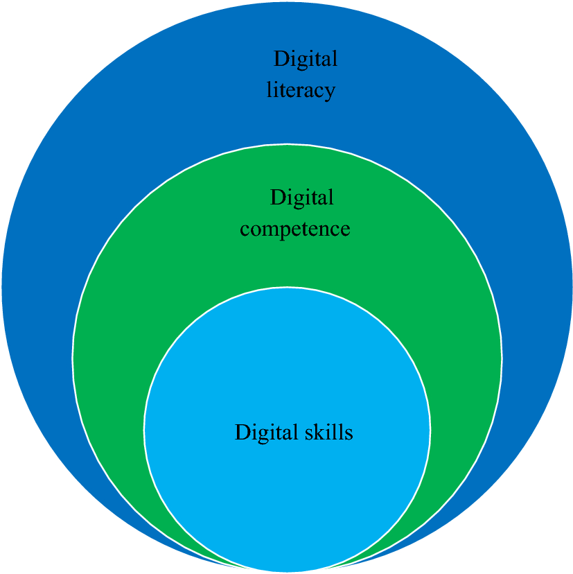
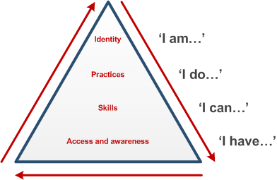

## What is Literacy?

### The Concept of Literacy

Let’s first start with “What is literacy?” Dictionaries define literacy as the ability to read and write. Within education, literacy is understood as the ability to read, write, and use arithmetic; the emphasis is on proficiency with language and numeracy.

It is important to pause and note that the term literacy has always held a degree of status. Globally, countries are often ranked in terms of literacy rates, compared by what percent of the adult population can read and write, for example. There is more complexity to the terms literate or illiterate, however, and a lot depends on context. “New literacy studies” view literacy as a situated practice; as in it all depends on where you come from and what your purpose is.

* * * 

> Use a common search engine like Google and type the term “literacy” into the search bar. Select the option to view the results as images and scroll through the visual depictions of literacy. What do these images depict about the concept of literacy?

* * *

Much of what you find in your search will probably suggest a relationship between literacy and words. This may be attributed to the fact that the concept has traditionally been associated with language—i.e., alphabetic literacy. In popular use, the word literacy has increasingly become a synonym for skill, competence, and proficiency—for example, emotional literacy and spiritual literacy, etc.

To better understand Digital Literacy, it is helpful to clarify the relationship between literacy, competence, and skills. 

**Literacy** is the broadest concept, referring to the foundational ability to understand, interpret, and produce information within a specific context. That information may be in the form of written text, music, art, or any other way of encoding. Literacy serves as the basis for developing competencies and skills.

**Competence** is a subset of literacy, representing a specific set of skills and contextual understanding to apply knowledge effectively in real-world scenarios. Competence is dynamic, requiring not only technical ability but also judgement, communication, and problem-solving.

**Skills** are the most specific and practical element, representing the very specific technical abilities or techniques used to perform tasks. While skills are essential teachable components, they gain significance when practiced within the broader context of competence and guided by the framework provided by literacy.

While these terms are interconnected, they reflect different layers of capability and application. <a href="https://dougbelshaw.com/blog/2012/07/12/on-the-important-differences-between-literacies-skills-and-competencies/" target="_blank">These differences are important</a>.

In summary, literacy is the overarching framework that enables individuals to develop competencies, which in turn depend on specific skills.

* * *

### Reflection: Are you literate?

> Have a think about the activities you undertake in your everyday life. Pick one, and think about it in terms of literacy, competencies and skills. What do these things look like in that context? For example, you might be an aspiring guitar player. 

| Aspect | Example |
|:---:|:---:|
| Skill | Playing a basic chord (e.g., G major) |
| Competency | Switching between chords smoothly in a song |
| Literacy | Understanding music theory and applying it to guitar playing |

* * *

Now that you've identified literacy, competency, and skill in an everyday activity, let’s consider how we recognise these in practice.
A **behavioural indicator** is an observable action that demonstrates someone’s level of literacy, competency, or skill. In education, we often assess learning by looking at these indicators.

> Thinking about the activity you examined in the earlier activity, identify at least one behavioural indicator for each level. For example, in the context of playing the guitar:

| Aspect | Example | Behavioral Indicator |
|:---:|:---:|:---:|
| Skill | Playing a basic chord (e.g., G major) | Fingers are placed correctly, the chord rings out cleanly |
| Competency | Switching between chords smoothly in a song | Transitions between chords are fluid and in time with the beat |
| Literacy | Understanding music theory and applying it to guitar playing | Can improvise over a chord progression, transposes a song to a different key |

So I might consider myself somewhat competent, my degree of literacy as a guitarist will depend on context. I might be deemed literate in a singalong with friends, but not so in a band context. As we'll see later, context is also important when talking about digital literacies.

### Climbing the pyramid

Another way of visualising this is Sharpe and Beetham’s (2010) [digital literacy development model](https://web.archive.org/web/20220120065520/https://www.jisc.ac.uk/full-guide/developing-digital-literacies). In this model, you can think of practices as the actions taken that are enabled by competencies.

Sharpe and Beetham’s ‘pyramid model’ of digital literacy development model (2010). Reproduced with permission of the authors.

The pyramid represents a cyclical process for developing digital literacy skills. At the base of the pyramid is awareness of technology and access to it. However, just because you have a piece of hardware or software doesn’t mean you have the ability to use it effectively. As you spend more time using technology, you become more confident in your technical, information, communication, and learning skills. You can then begin to apply those skills to make informed decisions and choices about how to use different technologies. As you move through the cycle, your experiences and practices contribute to the formation of your digital identity, while your identity informs your practices and drives the creative and appropriate use of technology.

* * *

Whatever your view of the word literacy, what is less questioned is the relationship between literacy and technology. Until quite recently, literacy has, for the most part, been associated with print technology. The increasingly important role that digital technology has taken in shaping our world has led to another defining moment in the evolution of literacy.

* * *

### Activity #3
#### My (Digital) Literacy Story
:fas fa-clock fa-fw: *Allow at least 60 minutes*
> Literacy narratives are stories about reading or composing a message in any form or context. They often include poignant memories that involve a personal experience with literacy. Digital literacy narratives can sometimes be categorised as ones that focus on how the writer came to understand the importance of technology in their life or pedagogy. More often, they are simply narratives that use a medium beyond the print-based essay to tell the story.
>
> Create your own literacy narrative that tells of a significant experience you had with digital literacy in your personal or professional life. Optionally, use a multi-modal tool that includes audio and images or video. You might like to consider depositing your literacy narrative into the <a href="https://www.thedaln.org/" target="_blank">Digital Archive of Literacy Narratives</a>.
>
> Visit the Tell us your story activity for full instructions and Activity Bank submission link.

[:fas fa-regular fa-university: Take it to the Bank!](https://elearn.waikato.ac.nz/ ":class=button")