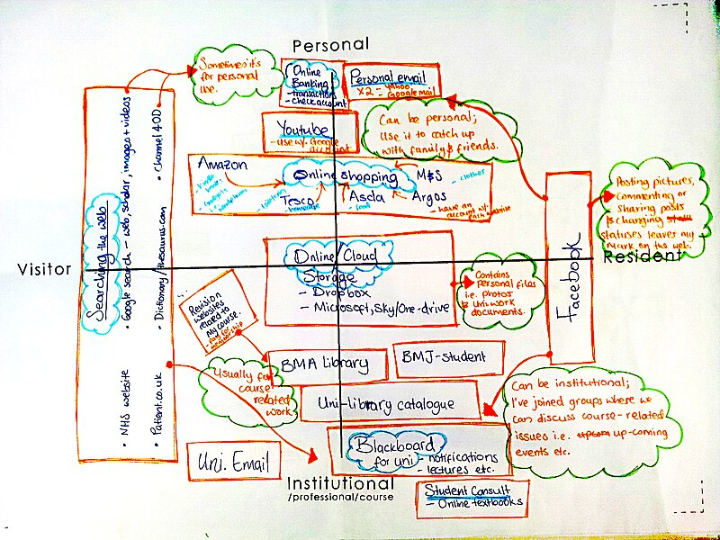

## Why is Digital Literacy Important?

As you watch the following video, reflect on why digital literacy matters to you.

  

    <iframe
      width="560"
      height="315"
      src="https://www.youtube.com/embed/p2k3C-iB88w?si=IX3YuU17WCThGj2A&amp;controls=0"></iframe>
  

* * *

> Why does digital literacy matter to you? Share your thoughts with the Community!

[:fas fa-regular fa-comments: Take me to the discussion!](https://elearn.waikato.ac.nz/":class=button")

* * *

You might be familiar with the concept of a “digital native” or the “net generation.” These terms suggest that a person who has been born or brought up during the age of digital technology will be familiar with computers and the Internet from an early age.

However, the digital native metaphor oversimplifies the relationship between age and technology, reinforcing stereotypes like “old people just don't get tech.” It also wrongly assumes younger generations inherently know how to use technology effectively for tasks like studying or critical thinking.

Digital literacies are not innate; they require intentional learning. As living, learning, and working increasingly move online, educators play a critical role in developing students’ digital competencies—from evaluating online information to engaging in professional and academic digital spaces.

* * *

### A More Nuanced Model: Visitors and Residents

Rather than linking digital skills to age, David White and Alison Le Cornu offer a more nuanced model based on motivation and context. Their Visitors and Residents continuum describes two modes of online engagement:

- **Visitors** use the web for specific tasks without leaving a social trace (e.g., online banking).
- **Residents** view the web as a place to interact with others, expressing their digital identity and leaving a social footprint (e.g., posting on social media).

People often shift between these modes based on context and motivation. Therefore, the model distinguishes between personal and institutional or professional online engagement. In practice, much activity falls in the middle of the continuum, within ‘closed’ groups or communities.

Understanding models like Visitors & Residents will help you reflect on how you—and your students—engage in online spaces.

  

    <iframe
      width="560"
      height="315"
      src="https://www.youtube.com/embed/MSK1Iw1XtwQ?si=A4Y7Isj37IzqcN6y"></iframe>
  

* * *

* * *

### Activity
#### Mapping

> Download the Visitors & Residents template and have a go at mapping your own digital practices. Take a look at some examples to help you get started.
>
> Visit the Visitors and Residents activity for full instructions and Activity Bank submission link.

[Take it to the Bank!](https://elearn.waikato.ac.nz/":class=button")

* * *

### Activity #3
#### Generational View of Digital Natives

> There are many cartoons online that comment on the amusing side of this concept. Do a search on Google (or your favourite search engine) for “digital native” a cartoon. You might see images of kids looking at a book with shock and asking each other, “Where is the ‘on’ button?” Or you might see a child returning home from school walking right past their parent exclaiming, “How do you think it was? They didn’t even have Wi-Fi!”

* * *

In fact, this generational desire to be constantly connected has even been inserted into Maslow’s hierarchy of needs as the ultimate foundation of basic human needs. This [psychological model](https://www.simplypsychology.org/maslow.html) is depicted as a pyramid with people’s basic survival needs as its foundation which need to be satisfied before people can realise their full potential.

People’s basic survival needs depicted as a pyramid.

However, there has been a lot of criticism about the concept of the digital native because it assumes many things, not least that somehow all young people have access to technology, that older people don’t have the same level of digital literacy as younger people, and that having access to technology automatically means you know how to use it.

So if young people are so adept at using digital technologies, why do they (and perhaps you for that matter) need to improve their digital literacy?

There are many answers, and hopefully this introduction has already hinted at some of them. One is that it’s not enough in this globally connected world to just be able to use technology. You need to be able to develop socially responsible digital practices and also to contribute to digital practices in your own personal, work, and learning lives.

One way of visualizing this is Sharpe and Beetham’s (2010) [digital literacy development model](https://www.jisc.ac.uk/full-guide/developing-digital-literacies).

Sharpe and Beetham’s ‘pyramid model’ of digital literacy development model (2010). Reproduced with permission of the authors.

The pyramid represents a cyclical process for developing digital literacy skills. At the base of the pyramid is awareness of technology and access to it. However, just because you have a piece of hardware or software doesn’t mean you have the ability to use it effectively. As you spend more time using technology, you become more confident in your technical, information, communication, and learning skills. You can then begin to apply those skills to make informed decisions and choices about how to use different technologies. As you move through the cycle, your experiences and practices contribute to the formation of your digital identity, while your identity informs your practices and drives the creative and appropriate use of technology.
